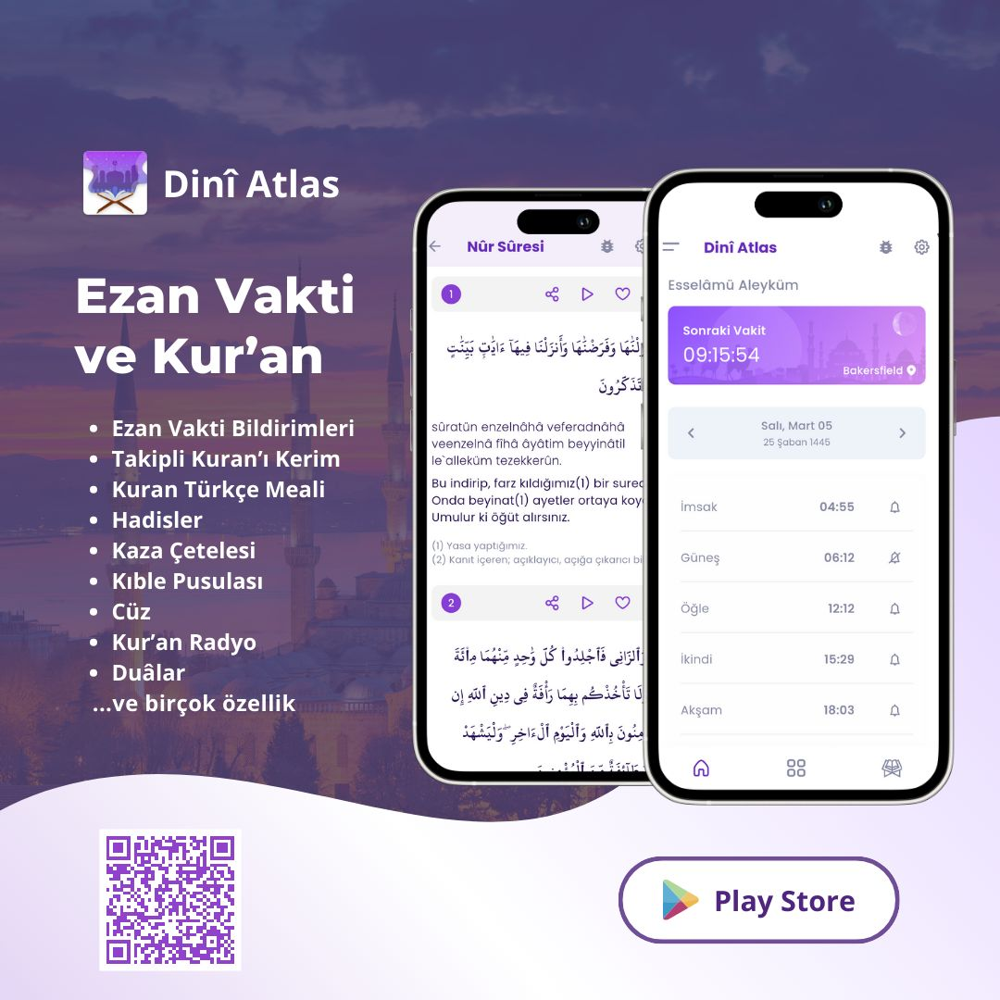
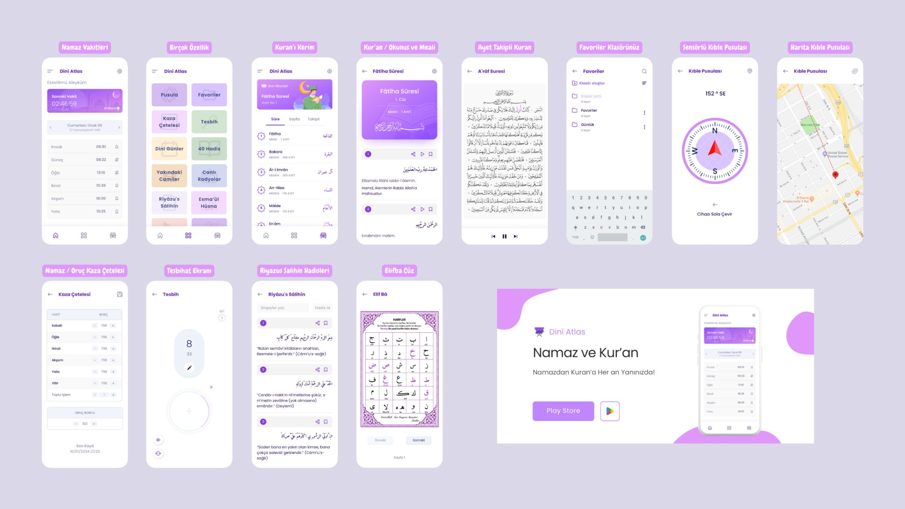

Uygulama Özellikleri

Namaz Vakitleri:
- Konuma göre otomatik veya manuel şehir seçimi
- Konumu değiştirerek mevcut konumda ezan vakitlerini güncelleme
- Namaz vakitleri için önceden, ezan vakti veya sonrası hatırlatma bildirimleri
- Ezan vakitlerinde ezan okuma veya bildirim sesi çalma
- Gelişmiş bildirim ayarlarıyla sessiz mod özelliği (Cihaz sesini namaz öncesi kapatıp namaz vaktinden sonra açma)
- Farklı ezan vakti alarmları veya isteğe bağlı bildirim ses seçenekleri
- Her vakit için istediğiniz vakitte hatırlatma bildirimleri
- Dini gün ve geceler takvimi
- Bayram günlerinde bayram namazı vakti gösterimi
- Hicri takvim belirteci
- Aylık ezan vakitleri ve imsakiye
- Ücretsiz ana ekran namaz vakti geri sayım widget görünümleri

Kuran'ı Kerim:
- Arapça, Türkçe okunuş ve meali ile birlikte detaylı ayarlar
- Farklı kişilerden Kuran dinleme
- Son okunan ayet gösterimi, kaldığın yerden devam etme
- Okunan Kuranı Kerim sure ve ayeti favorilere ekleyebilme, klasör oluşturma
- Kuran'ı Kerim sureler hakkında detaylı bilgiler
- Sure içerisinde istenilen ayete anında gidebilme
- Ayet takipli Kuranı Kerim özelliği ile okunan ayeti aynı anda takip edebilirsiniz

Diğer Özellikler:
- Story (Hikaye)
- Yasin-i Şerif Kitapçığı
- Günlük seçilmiş ayet / dua / hadis
- Otomatik kıble yönü bulma, sensörlü ve harita kıble pusulası, manyetik alan belirteci
- Kaza Çetelesi: Namaz ve oruç kazalarınızı takip edebileceğiniz bulut depolamalı takip ekranı
- Tesbih özelliği: Sesli veya titreşimli olarak istediğiniz set miktarınca tesbih çekebilirsiniz
- 40 Hadis Arapça ve Türkçe, favorilere kaydetme
- Riyazus Salihin hadisleri: Hadis içerisinde numara veya Türkçe kelime ile arama yapma, favorilere ekleme
- Esmaül Hüsna ekranı
- Günlük dualar ekranı
- Elifba, Kuran öğrenme için interaktif bir bölüm
- Tüm metinsel içerikleri (Kuran'ı Kerim, hadisler, dualar v.b) görsel olarak paylaşabilme özelliği
- Kuran Radyo ile Canlı Kuran-ı Kerim dinleme
- Yakın Camiler ekranı ile bulunduğunuz konuma en yakın camileri görme
- Her sayfada hata / sorun bildirme seçeneği.
- Reklamsız kullanım için üyelik seçeneği
- ___
.
.
